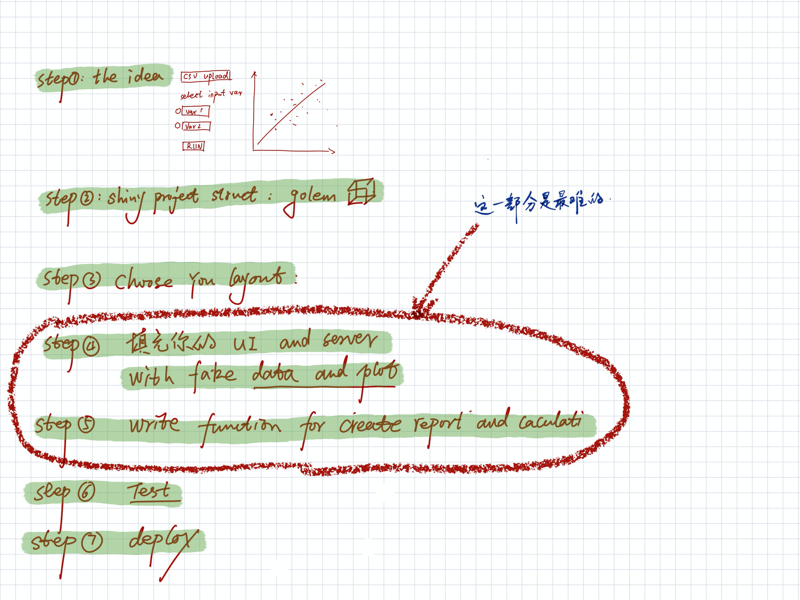

```{r, include = FALSE}
knitr::opts_chunk$set(
  collapse = TRUE,
  comment = "#>"
)
```

```{r setup}
library(shiy4tools)
```




# Step 01: the idea
# Step 02: shiy project structure(golem)
# Step 03: choose your layout system
# Step 04: fill UI and server with fake data and plot
# Step 05: write function and module for server
# Step 06: test and debug
# Step 07: deploy 


# Ref

[How to Build an App in R Shiny | by Mate Pocs | Towards Data Science](https://radiant-brushlands-42789.herokuapp.com/towardsdatascience.com/how-to-build-a-data-analysis-app-in-r-shiny-143bee9338f7)

[7 Easy Steps to Building your Own Shiny App from Scratch – JEPS Bulletin](https://blog.efpsa.org/2019/04/24/7-easy-steps-to-building-your-own-shiny-app-from-scratch/)

